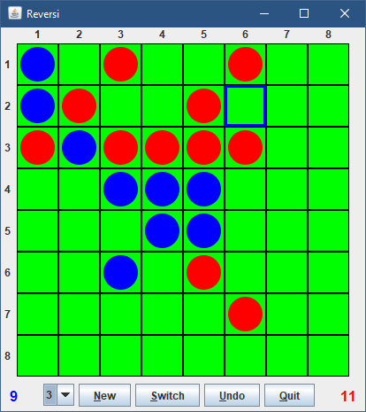
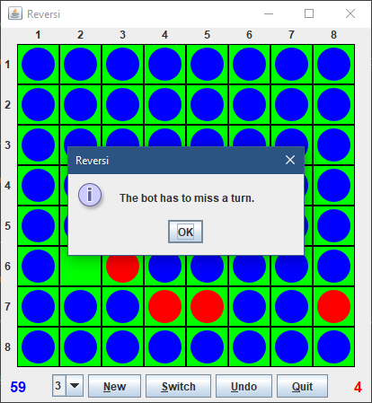
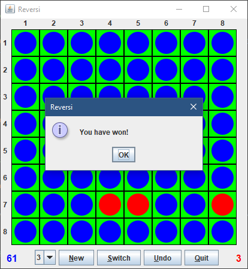

# Reversi

This is a Java implementation of the famous board game [Reversi](https://en.wikipedia.org/wiki/Reversi).
Are you ready to outhink the computer on levels of increasing difficulty?

## Getting Started

Simply download the executable JAR file from the latest release.
In case you want to compile the game yourself: The main class is `io.kirschstein.reversi.Main`.

## Screenshots

### The GUI

### The end game

The only remaining slot would not be a valid move for the computer and hence it must miss this turn.

After the human player occupies that slot, the game ends with their victory.

